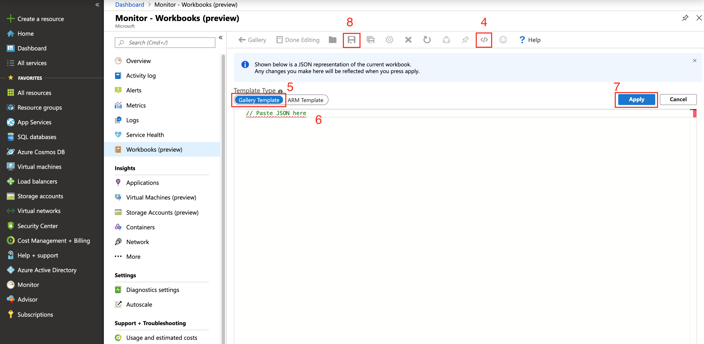

# IoT Edge Hub Azure Monitor Workbook

1. Replace the **defaultResourceIds** key at the bottom of [workbook json](https://raw.githubusercontent.com/veyalla/ehm/master/azmon-workbook-template/edgehub-dashboard.json) with resource Id of Azure Monitor Log Analytics workspace and copy the JSON.
    >The easiest way to get this resourceId is `az resource list | grep "OperationalInsights" | grep "id"` from the az cli.

1. Import using steps labeled in the two screenshots below:
    
    

